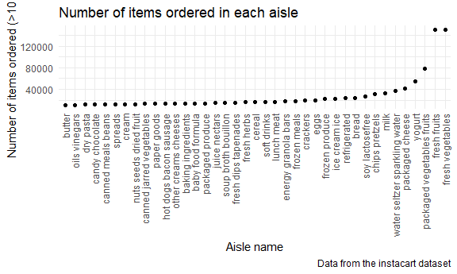
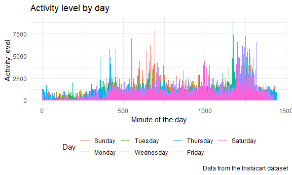
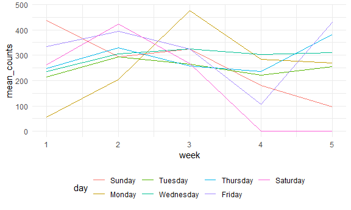
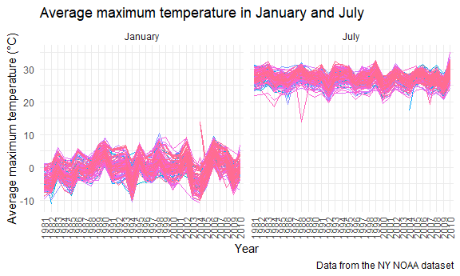
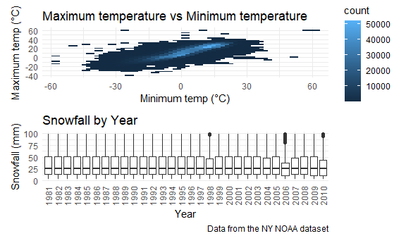

Homework 3
================
Lily Wang
10/4/2020

This is my solution to Homework 3.

``` r
library(tidyverse)
```

    ## -- Attaching packages ---------------------------- tidyverse 1.3.0 --

    ## v ggplot2 3.3.2     v purrr   0.3.4
    ## v tibble  3.0.3     v dplyr   1.0.2
    ## v tidyr   1.1.2     v stringr 1.4.0
    ## v readr   1.3.1     v forcats 0.5.0

    ## -- Conflicts ------------------------------- tidyverse_conflicts() --
    ## x dplyr::filter() masks stats::filter()
    ## x dplyr::lag()    masks stats::lag()

``` r
library(hexbin)
library(patchwork)
library(p8105.datasets)

knitr::opts_chunk$set(
  fig.width = 6,
  fig.asp = .6,
  out.width = "90%"
)

theme_set(theme_minimal() + theme(legend.position = "bottom"))
```

## Problem 1

Load and clean dataset:

``` r
data("instacart")
```

The `instacart` dataset contains information on online grocery orders
from users of Instacart, an online grocery service that allows you to
shop online from local stores. Each observation is one item ordered by a
user. Specifically, there are variables of the IDs of orders, products,
and users, when the order was placed, how many days passed since the
last order, the name of the product ordered, and what aisle and
department it was from. The dataset has 1384617 rows and 15 columns.

``` r
instacart %>% 
  count(aisle) %>% 
  arrange(desc(n))
```

    ## # A tibble: 134 x 2
    ##    aisle                              n
    ##    <chr>                          <int>
    ##  1 fresh vegetables              150609
    ##  2 fresh fruits                  150473
    ##  3 packaged vegetables fruits     78493
    ##  4 yogurt                         55240
    ##  5 packaged cheese                41699
    ##  6 water seltzer sparkling water  36617
    ##  7 milk                           32644
    ##  8 chips pretzels                 31269
    ##  9 soy lactosefree                26240
    ## 10 bread                          23635
    ## # ... with 124 more rows

There are 134 distinct aisles. The aisles with the most products are
fresh vegetables, fresh fruits, packaged vegetables and fruits, and
yogurt.

Making a plot that shows the number of items ordered in each aisle,
limiting this to aisles with more than 10000 items ordered:

``` r
instacart %>% 
  count(aisle) %>% 
  filter(n > 10000) %>% 
  mutate(
    aisle = factor(aisle),
    aisle = fct_reorder(aisle, n)
  ) %>% 
  ggplot(aes(x = aisle, y = n)) +
  geom_point() +
  theme(axis.text.x = element_text(angle = 90, vjust = 0.5, hjust = 1)) +
  labs(
    title = "Number of items ordered in each aisle",
    x = "Aisle name",
    y = "Number of items ordered (>10,000)",
    caption = "Data from the instacart dataset"
  )
```



Making a table showing the three most popular items in each of the
aisles “baking ingredients”, “dog food care”, and “packaged vegetables
fruits”. Number of times each item is ordered is included:

``` r
instacart %>% 
  filter(aisle %in% c("baking ingredients", "dog food care", "packaged vegetables fruits")) %>% 
  group_by(aisle) %>% 
  count(product_name) %>% 
  mutate(
    rank = min_rank(desc(n))
  ) %>% 
  filter(rank < 4) %>% 
  arrange(aisle, rank) %>% 
  knitr::kable(digits = 0)
```

| aisle                      | product\_name                                 |    n | rank |
| :------------------------- | :-------------------------------------------- | ---: | ---: |
| baking ingredients         | Light Brown Sugar                             |  499 |    1 |
| baking ingredients         | Pure Baking Soda                              |  387 |    2 |
| baking ingredients         | Cane Sugar                                    |  336 |    3 |
| dog food care              | Snack Sticks Chicken & Rice Recipe Dog Treats |   30 |    1 |
| dog food care              | Organix Chicken & Brown Rice Recipe           |   28 |    2 |
| dog food care              | Small Dog Biscuits                            |   26 |    3 |
| packaged vegetables fruits | Organic Baby Spinach                          | 9784 |    1 |
| packaged vegetables fruits | Organic Raspberries                           | 5546 |    2 |
| packaged vegetables fruits | Organic Blueberries                           | 4966 |    3 |

Making a table showing the mean hour of the day at which Pink Lady
Apples and Coffee Ice Cream are ordered on each day of the week:

``` r
instacart %>% 
  filter(product_name %in% c("Pink Lady Apples", "Coffee Ice Cream")) %>% 
  group_by(product_name, order_dow) %>% 
  summarize(mean_hour = mean(order_hour_of_day)) %>% 
  pivot_wider(
    names_from = order_dow,
    values_from = mean_hour
  ) %>% 
  knitr::kable(digits = 0)
```

    ## `summarise()` regrouping output by 'product_name' (override with `.groups` argument)

| product\_name    |  0 |  1 |  2 |  3 |  4 |  5 |  6 |
| :--------------- | -: | -: | -: | -: | -: | -: | -: |
| Coffee Ice Cream | 14 | 14 | 15 | 15 | 15 | 12 | 14 |
| Pink Lady Apples | 13 | 11 | 12 | 14 | 12 | 13 | 12 |

## Problem 2

Importing and wrangling the `accel_data` dataset and adding a weekend vs
weekday variable:

``` r
accel_df <- read_csv("./data/accel_data.csv") %>% 
  janitor::clean_names() %>% 
  pivot_longer(
    starts_with("activity_"),
    names_to = "activity",
    names_prefix = "activity_",
    values_to = "counts"
  ) %>% 
  mutate(
    activity = as.numeric(activity),
    day = factor(day),
    day = fct_relevel(day, c("Sunday", "Monday", "Tuesday", "Wednesday", "Thursday", "Friday", "Saturday")),
    weekend = if_else(day == "Saturday" | day == "Sunday", "weekend", "weekday")) %>% 
  relocate(week, day_id, day, weekend, everything()) %>% 
  arrange(week, day)
```

    ## Parsed with column specification:
    ## cols(
    ##   .default = col_double(),
    ##   day = col_character()
    ## )

    ## See spec(...) for full column specifications.

The current dataset contains accelerometer data of a 63-year-old male
who was admitted to the Advanced Cardiac Care Center of Columbia
University Medical Center and diagnosed with congestive heart failure
(CHF). The accelerometer measures activity counts for each minute of a
24-hour day starting at midnight. Variables include week number, day of
the week, whether the day is a weekday or weekend, activity number
(corresponding to each of the 1440 minutes of the day) and activity
count as measured by the accelerometer. The dataset contains 50400 rows
and 6 columns.

Aggregate across minutes to create a total activity variable for each
day:

``` r
accel_df %>% 
  group_by(week, day) %>% 
  summarize(
    total_activity = sum(counts)) %>% 
  knitr::kable(digits = 0)
```

    ## `summarise()` regrouping output by 'week' (override with `.groups` argument)

| week | day       | total\_activity |
| ---: | :-------- | --------------: |
|    1 | Sunday    |          631105 |
|    1 | Monday    |           78828 |
|    1 | Tuesday   |          307094 |
|    1 | Wednesday |          340115 |
|    1 | Thursday  |          355924 |
|    1 | Friday    |          480543 |
|    1 | Saturday  |          376254 |
|    2 | Sunday    |          422018 |
|    2 | Monday    |          295431 |
|    2 | Tuesday   |          423245 |
|    2 | Wednesday |          440962 |
|    2 | Thursday  |          474048 |
|    2 | Friday    |          568839 |
|    2 | Saturday  |          607175 |
|    3 | Sunday    |          467052 |
|    3 | Monday    |          685910 |
|    3 | Tuesday   |          381507 |
|    3 | Wednesday |          468869 |
|    3 | Thursday  |          371230 |
|    3 | Friday    |          467420 |
|    3 | Saturday  |          382928 |
|    4 | Sunday    |          260617 |
|    4 | Monday    |          409450 |
|    4 | Tuesday   |          319568 |
|    4 | Wednesday |          434460 |
|    4 | Thursday  |          340291 |
|    4 | Friday    |          154049 |
|    4 | Saturday  |            1440 |
|    5 | Sunday    |          138421 |
|    5 | Monday    |          389080 |
|    5 | Tuesday   |          367824 |
|    5 | Wednesday |          445366 |
|    5 | Thursday  |          549658 |
|    5 | Friday    |          620860 |
|    5 | Saturday  |            1440 |

Weekends of Week 4 and 5 seem to have lower activity. Let’s plot these:

``` r
accel_df %>% 
  ggplot(aes(x = activity, y = counts, color = day)) +
  geom_line() +
  theme(legend.position = "bottom")
```



That graph is quite messy so let’s try using mean counts?

``` r
accel_df %>% 
  group_by(week, day) %>% 
  summarize(mean_counts = mean(counts)) %>% 
  ggplot(aes(x = week, y = mean_counts, color = day)) +
  geom_line() 
```

    ## `summarise()` regrouping output by 'week' (override with `.groups` argument)



## Problem 3

``` r
data("ny_noaa")
```

The `ny_noaa` dataset contains weather information from the National
Oceanic and Atmospheric Association for all New York State weather
stations from January 1, 1981 through December 31, 2010. Specifically,
the dataset contains the weather station ID, date of observation, amount
of precipitation (in tenths of mm) and snow (in mm), and minimum and
maximum temperature (in tenths of degrees C). Each weather station may
collect only a subset of these variables, and therefore the resulting
dataset contains extensive missing data. The current dataset is 2595176
rows and 7 columns.

Cleaning the dataset and changing tenths of a unit to a whole unit:

``` r
ny_noaa <-  
  janitor::clean_names(ny_noaa) %>% 
  separate(date, c("year", "month", "day"), "-") %>% 
  mutate(
    tmin = as.numeric(tmin),
    tmax = as.numeric(tmax),
    tmin = tmin / 10,
    tmax = tmax / 10,
    prcp = prcp / 10
  ) %>% 
  drop_na()
```

Finding out what the most commonly observed values for snowfall:

``` r
ny_noaa %>%
  count(snow) %>% 
  arrange(desc(n))
```

    ## # A tibble: 248 x 2
    ##     snow       n
    ##    <int>   <int>
    ##  1     0 1112758
    ##  2    25   15809
    ##  3    13   12460
    ##  4    51    9252
    ##  5     5    5669
    ##  6     8    5380
    ##  7    76    5296
    ##  8     3    5276
    ##  9    38    5050
    ## 10   102    3386
    ## # ... with 238 more rows

The most commonly observed values for snowfall are 0 mm and `NA`. 0
makes sense because in NY, there are many days where it does not snow.
`NA` makes sense because there is a lot of missing data.

Plotting average max temperature in January and July in each station
across years:

``` r
ny_noaa %>% 
  filter(month == c("01", "07")) %>% 
  group_by(id, year, month) %>% 
  summarize(mean_tmax = mean(tmax)) %>% 
  ungroup() %>% 
  ggplot(aes(x = year, y = mean_tmax, group = id, color = id)) +
  geom_path() +
  facet_grid(~month) +
  theme(axis.text.x = element_text(angle = 90, vjust = 0.5, hjust = 1)) +
  theme(legend.position = "none") +
  labs(
    title = "Average maximum temperature in January and July",
    x = "Year",
    y = "Average maximum temperature (\u00B0C)",
    caption = "Data from the NY NOAA dataset"
  )
```

    ## Warning in month == c("01", "07"): longer object length is not a multiple of
    ## shorter object length

    ## `summarise()` regrouping output by 'id', 'year' (override with `.groups` argument)



Average maximum temperature is higher in July than January overall,
which makes sense as it is summer in NY.

Plotting `tmax` vs `tmin` on one graph and showing the distribution of
snowfall values greater than 0 and less than 100 separately by year on a
second graph:

``` r
tmax_tmin_plot <- 
  ny_noaa %>% 
  ggplot(aes(x = tmin, y = tmax)) + 
  geom_hex() +
  theme(legend.position = "right") +
  labs(
    title = "Maximum temperature vs Minimum temperature",
    x = "Minimum temp (\u00B0C)",
    y = "Maximum temp (\u00B0C)"
  )

snowfall_plot <-
  ny_noaa %>% 
  filter(snow > 0 & snow < 100) %>% 
  ggplot(aes(x = year, y = snow)) +
  geom_boxplot() +
  theme(axis.text.x = element_text(angle = 90, vjust = 0.5, hjust = 1)) +
  labs(
    title = "Snowfall by Year",
    x = "Year",
    y = "Snowfall (mm)",
    caption = "Data from the NY NOAA dataset"
  )

tmax_tmin_plot / snowfall_plot
```



In general, as minimum temperature increases, so does maximum
temperatue. The median snowfall every year is 25 mm, with Q1 around 13
mm and Q3 around 50 mm. There are a few years, like 1998 and 2006, that
had less snowfall.
